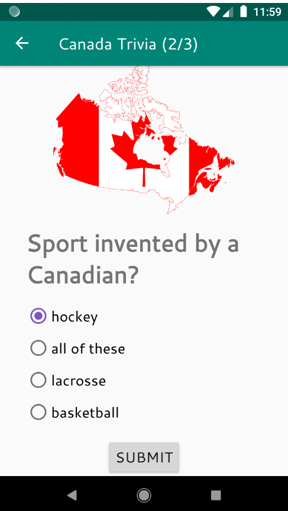

This is a simple trivia app based on the toy app for lesson 3 of the [Android App Development in Kotlin course on Udacity](https://www.udacity.com/course/developing-android-apps-with-kotlin--ud9012).

It is fully functional when launched using an Android emulator (for example, within Android Studio). But it is not completely finished. Drawable resources from the base app still need to be replaced.

## Canada Trivia 

Canada Trivia asks the user trivia questions about Canada.  
It makes use of the Navigation component within Jetpack to move the user between different screens.  Each screen is implemented as a Fragment.
The app navigates using buttons, the Action Bar, and the Navigation Drawer.

## Screenshots

 

